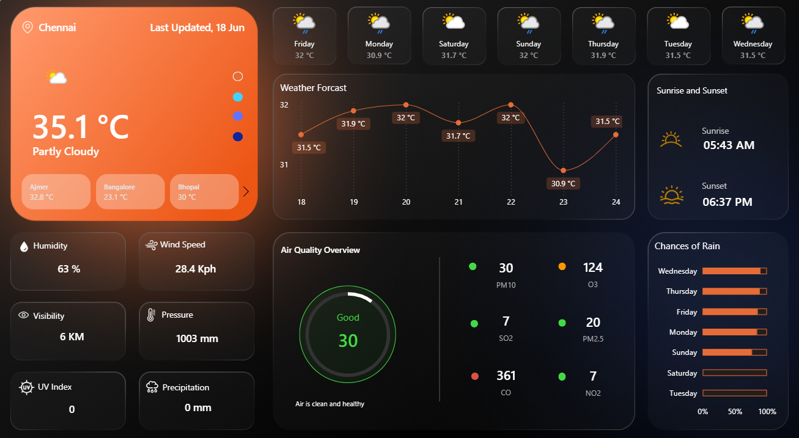

# 🌦️ Weather Dashboard – Power BI Project

---

## 📌 Project Overview

The **Weather Dashboard** is an interactive Power BI project designed to analyze and visualize weather data across different regions and time periods.

This dashboard helps users:

- Monitor temperature trends  
- Analyze humidity and precipitation patterns  
- Track wind speed variations  
- Compare weather conditions across cities  
- Identify seasonal patterns  

The project demonstrates strong skills in **data modeling, DAX, visualization design, and dashboard storytelling**.

---

## 🔗 Live Dashboard Link

👉 **View Dashboard Here:**  
[Click to Open Weather Dashboard](https://community.fabric.microsoft.com/t5/Data-Stories-Gallery/Used-Car-Sales-Analysis-Template-DataFlip/td-p/5115715)

*(Replace the above link with your published Power BI Service link)*

---

## 🎯 Business Objective

Weather analysis is essential for:

- Logistics & supply chain planning  
- Agriculture forecasting  
- Travel & tourism insights  
- Climate trend analysis  
- Energy consumption planning  

This dashboard provides actionable insights using structured weather datasets.

---

## 🛠️ Tools & Technologies Used

- Power BI Desktop  
- Power BI Service (for publishing)  
- Power Query (Data Cleaning & Transformation)  
- DAX (Data Analysis Expressions)  
- Data Modeling (Star Schema)  
- Custom Visualizations  

---

## 📊 Dataset Description

The dataset includes:

| Column Name        | Description |
|--------------------|------------|
| Date               | Observation date |
| City               | Location name |
| Temperature (°C)   | Daily temperature |
| Humidity (%)       | Humidity level |
| Wind Speed (km/h)  | Wind intensity |
| Precipitation (mm) | Rainfall amount |
| Weather Condition  | Sunny, Rainy, Cloudy, etc. |

---

## ⚙️ Data Modeling Approach

- Created Date Dimension Table  
- Established relationships between fact and dimension tables  
- Applied calculated columns and measures  
- Used time intelligence functions for trend analysis  

---

